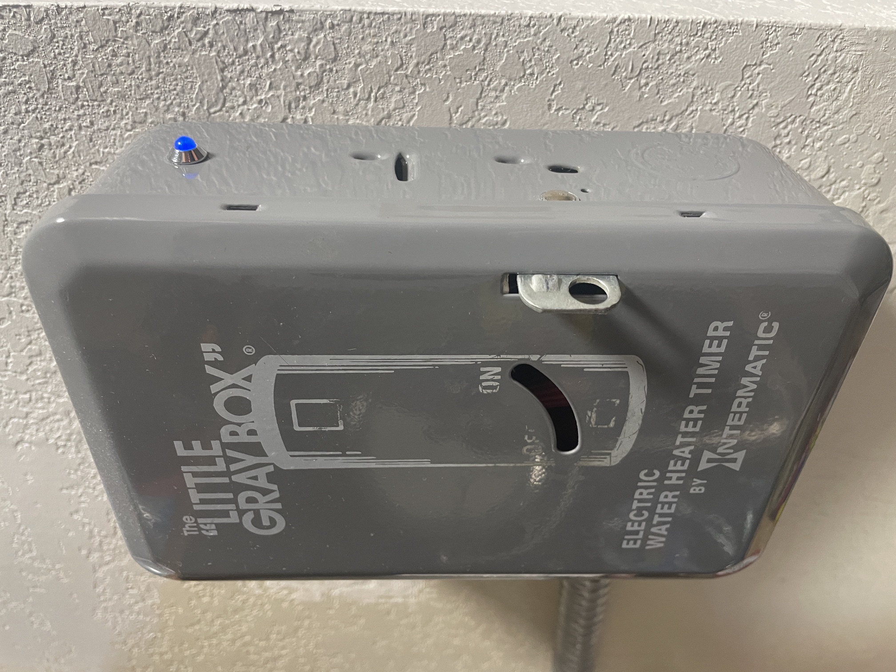
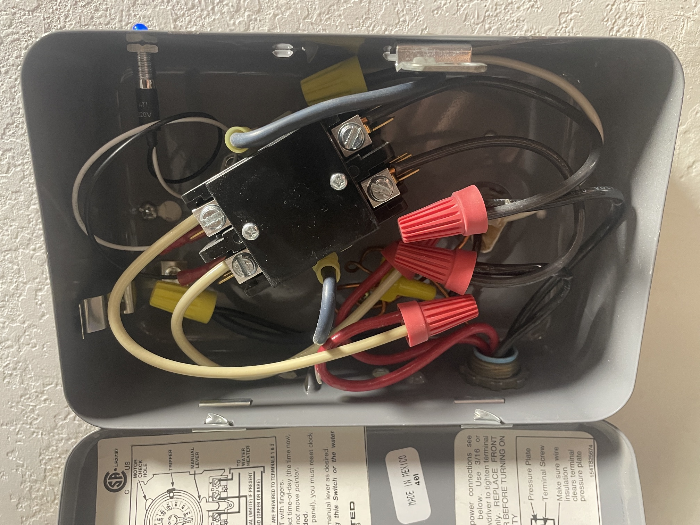
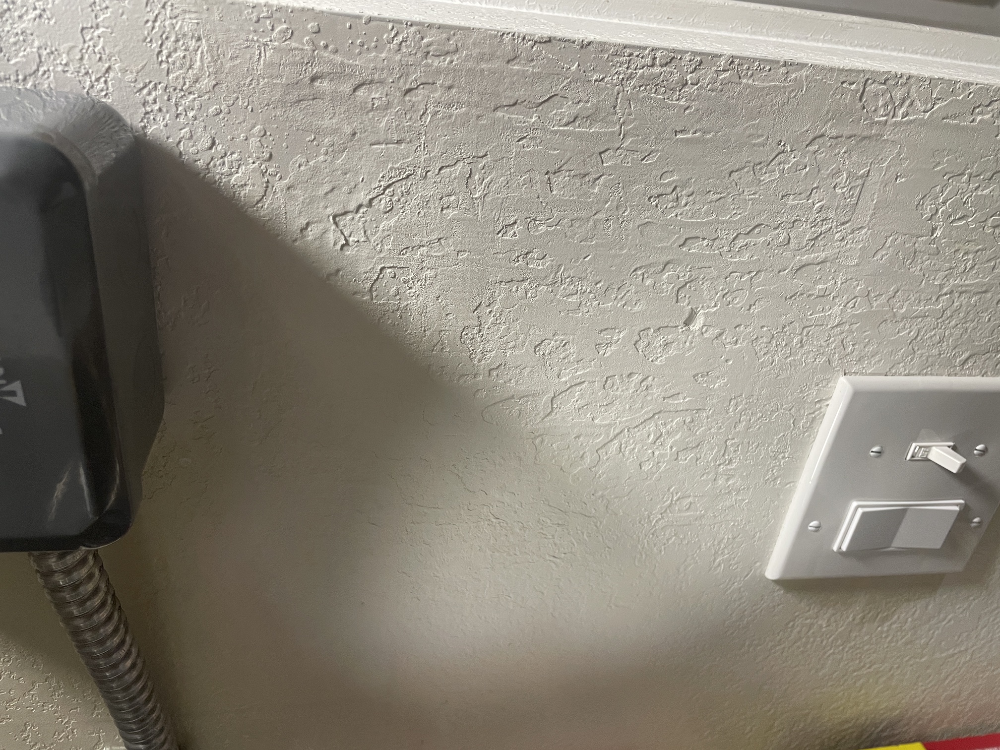

# Hubitat Water Heater & Holiday Management Suite

An advanced, local-first automation suite designed for Hubitat Elevation to optimize heavy-load water heaters against time-of-use (TOU) electrical plans. 

This repository contains both the software automation logic and a cost-effective, heavy-duty hardware blueprint utilizing a custom-built Z-Wave contactor enclosure.

---

## 🛠️ Hardware Implementation: The "Poor Man's" Heavy-Duty Z-Wave Switch

Commercial 40-Amp Z-Wave smart switches can easily cost $100 or more. This setup achieves the exact same industrial-grade performance for a fraction of the cost by retrofitting a classic Intermatic mechanical timer enclosure with a dedicated contactor and a standard 120V Z-Wave switch. Any old electrical box with enough space will work though.

### Hardware Gallery
| Enclosure Exterior | Gutted Enclosure & Relay Wiring | Control Switch Integration |
| :---: | :---: | :---: |
|  |  |  |

### How It Works & Wiring Concept
1. **The Enclosure:** A classic Intermatic "Little Gray Box" electric water heater timer was gutted, removing the mechanical clock dial while retaining the rugged, code-compliant metal chassis.
2. **The Contactor:** An industrial-grade **240V dual-pole contactor** is mounted inside the box to safely interrupt both hot lines (L1 and L2) feeding the heavy resistive load of the water heater. https://www.amazon.com/dp/B004Z0RLL2?ref_=ppx_hzsearch_conn_dt_b_fed_asin_title_3
3. **The 120V Switching Logic:** Instead of using an expensive high-amperage smart switch, the contactor's internal coil is energized using a standard **120V circuit managed by an in-wall Z-Wave smart switch** (located below the enclosure). 
4. **Status Indicator:** A custom 120V LED pilot light is drilled and tapped into the side of the metal chassis, wired in parallel with the contactor coil to provide an immediate, physical visual confirmation when the water heater elements are actively powered.

*This decoupling of control logic (120V Z-Wave Switch) from the heavy load management (240V Contactor) ensures maximum hardware longevity and cost savings.*

---

## 🤖 Rule 1: Water Heater - Master Control

This Hubitat Rule Machine automation handles the heavy lifting, ensuring the water heater runs primarily during cheapest off-peak windows and stays off during peak hours unless an observed holiday overrides the schedule.

### Logic Breakdown

#### 1. Required Expression (M-F Restriction)

Day in [Monday, Tuesday, Wednesday, Thursday, Friday]
Evaluate Required Expression on System Startup
Triggers only evaluate on weekdays. On weekends, standard hardware behaviors or separate weekend rules apply.

2. Trigger Events
When time is 10:00 AM
When time is 3:00 PM
When time is 7:00 PM

3. Actions to Run
Plaintext
IF (Time is 10:00 AM) THEN
    // Off Peak Hours. This turns WH ON M-F at 10AM - 3PM.
    On: Water Heater

ELSE-IF (Time is 3:00 PM AND vS Holiday Is Today? is off) THEN
    Off: Water Heater

// Turns on WH at 7PM M-F IF the Water Heater Virtual Switch is ON. 
// Turns off after 90 minutes. Unless it's a power company-observed Holiday, then this rule is skipped and the WH stays on.
ELSE-IF (Time is 7:00 PM AND vS Holiday Is Today? is off AND vS Water Heater is on) THEN
    On: Water Heater
    Delay 1:30:00
    Off: Water Heater
END-IF
10:00 AM: Turns the heater ON to capitalize on daytime off-peak rates.

3:00 PM: Sheds the load by turning it OFF just as peak pricing begins—unless vS Holiday Is Today? is active.

7:00 PM: Initiates a strict 90-minute reheat boost after peak hours end, contingent on the vS Water Heater master toggle being enabled, preventing overnight standby loss.

🧪 Rule 2: zAnnual Holiday Manager (Experimental)
⚠️ Implementation Note: This rule is provided as an open-source concept. In production environments, complex multi-holiday Cron strings within a single trigger can occasionally be temperamental or high-maintenance on hub resources. It is included here for users who want to experiment with or optimize local Cron holiday tracking.

This rule uses a complex, multi-segmented Cron trigger string to automatically spot major fixed and floating utility holidays at midnight, flipping the holiday flag for 24 hours.

Trigger Events
Periodic Cron String: 0 0 0 1 1 ? * ; 0 0 0 ? 1 2#3 * ; 0 0 0 ? 2 2#3 * ; 0 0 0 ? 5 2L * ; 0 0 0 19 6 ? * ; 0 0 0 4 7 ? * ; 0 0 0 ? 9 2#1 * ; 0 0 0 ? 10 2#2 * ; 0 0 0 11 11 ? * ; 0 0 0 ? 11 4#4 * ; 0 0 0 25 12 ? *

This composite Cron expression targets common US/utility holidays at exactly 00:00:00 (Midnight), including New Year's Day, Memorial Day, Independence Day, Labor Day, Thanksgiving, and Christmas.

Actions to Run
Plaintext
On: vS Holiday Is Today?
Delay 23:59:00
Off: vS Holiday Is Today?
When midnight strikes on any matched date, the rule flips the virtual holiday switch to ON, waits 23 hours and 59 minutes, and turns it back OFF to reset for the next standard day.

⚙️ Prerequisites & Virtual Devices
To deploy this ecosystem, create the following virtual devices in your Hubitat Devices tab:

Water Heater: Linked to the 120V Z-Wave switch controlling the contactor coil.

vS Holiday Is Today?: Virtual Switch. Used by the Master Control rule to bypass peak-shedding. (If you choose not to use the experimental Cron rule, this can easily be toggled by a community Google Calendar integration or Node-RED workflow).

vS Water Heater: Virtual Switch. Serving as your master enable switch for allowing the 7:00 PM post-peak evening warm-up window.

🤝 Contributing & Feedback
Have an optimization for the hardware layout or a cleaner way to handle utility holidays locally on Hubitat without cloud dependencies? Feel free to fork, submit a pull request, or open an issue!
